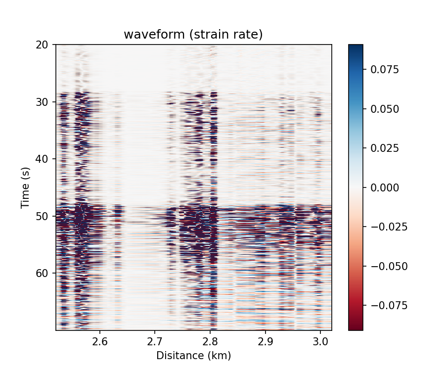
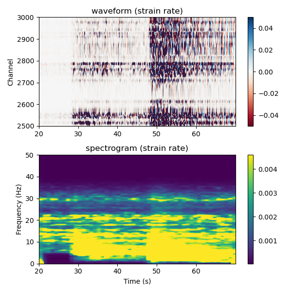

Visualization
=============================================

DASPy uses the ``Section`` class method/function ``plot`` to plot images.

Call Class Method
------------------------------

Plot and show image：

    >>> from daspy import read
    >>> sec = read()
    >>> sec.plot()

When drawing frequency domain graphs, you can set the ``kwargs_pro`` parameter to specify how the spectrum is plotted:

    >>> sec.plot(obj='fk', kwargs_pro=dict(taper=(0.02, 0.05), nfft=(1024, 8192))) # set the coefficient of 2D cosine taper to (0.02,0.05), output points of 2DFFT to (1024, 8192)

.. image:: ../media/fk.png
    :width: 600

Plot in ``Matplotlib.axes.Axes``:

    >>> import matplotlib.pyplot as plt
    >>> fig, ax = plt.subplots(2, 1, figsize=(6,6))
    >>> sec.plot(ax=ax[0], obj='waveform', xmode='channel', tmode='origin', xlabel=False, transpose=True, vmax=0.05) # set the spatial axis to the channel number, the time axis to the time after the event occurred, do not draw the x-axis label, invert the default x/y axis, and set the data range to -0.05~0.05
    >>> sec.plot(ax=ax[1], obj='spectrogram', tmode='origin', kwargs_pro=dict(noverlap=156)) # overlap between two windows is 156 points
    >>> plt.tight_layout()
    >>> plt.show()

Call the function
------------------------------

First calculate the spectrum, perform other calculations on the output, and then use the ``daspy.basic_tools.visualization.plot`` function to plot:

    >>> import numpy as np
    >>> from daspy.basic_tools.visualization import plot
    >>> spec, f = sec.spectrum()
    >>> spec = 10 * np.log10(abs(spec) ** 2) # convert the spectrum to units of decibels (dB), using 1 as the reference value
    >>> plot(spec, obj='spectrum', f=f, xmode='channel') # set the spatial axis to the channel number, the time axis to the time after the event occurred, and invert the default x/y axis

.. image:: ../media/spectrum.png
    :width: 600